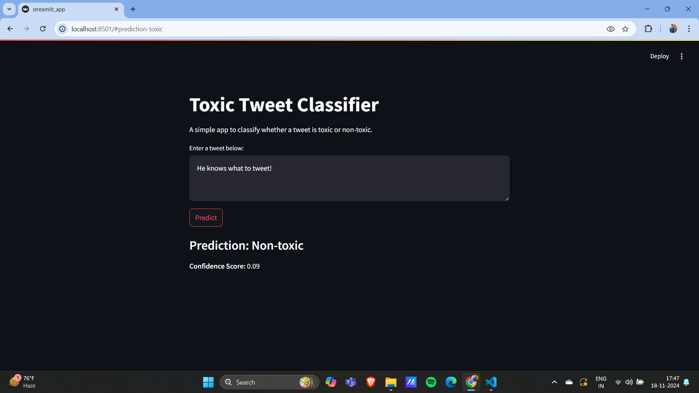
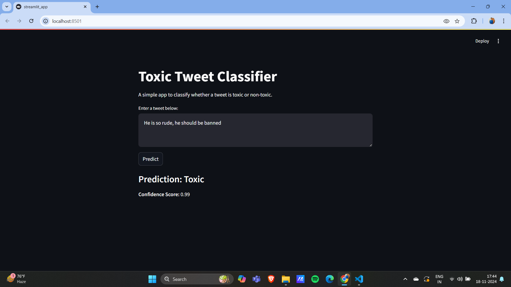

# Toxic Tweet Classification

## Overview
This project is a **Toxic Tweet Classification** model designed to identify and classify toxic content in tweets. Using **TensorFlow**, the model performs binary classification to label tweets as either toxic or non-toxic. The project involves preprocessing tweet data, training a deep learning model to detect harmful language, and evaluating its performance. This tool can be used to filter harmful content on social media platforms, contributing to a safer online environment.

## Key Features
- **Text Preprocessing**: Cleans and normalizes tweet text by removing URLs, mentions, hashtags, and special characters.
- **Toxicity Classification**: Classifies tweets as toxic or non-toxic using a neural network model built with TensorFlow.
- **Model Training**: Trains the model using a dataset of tweets labeled with toxicity information.
- **Evaluation and Reporting**: Generates a classification report to assess the model's accuracy, precision, recall, and F1-score.

## Use Case Scenario
Imagine a social media platform like Twitter wanting to automatically detect and filter out harmful or offensive tweets. A company can use this tool to train a model that classifies tweets as toxic or non-toxic, enabling the platform to flag or remove harmful content in real-time, ensuring a safer online environment for users.

## Tech Stack
- **TensorFlow**: Used for building and training the deep learning model.
- **scikit-learn**: Used for model evaluation and generating classification reports.
- **Pandas**: For data manipulation and preprocessing.
- **Python**: The programming language used to implement the entire pipeline.

The project reads a dataset of tweets stored in FinalBalancedDataset.csv, which contains the tweet text and a label indicating whether the tweet is toxic (1) or non-toxic (0).
The tweet text is preprocessed by removing URLs, mentions, and special characters.
The text is then vectorized using TensorFlow’s TextVectorization layer.
The model is trained for 5 epochs to classify tweets into toxic and non-toxic categories.
After training, the model's performance is evaluated on a validation set, and a classification report is generated, which includes accuracy, precision, recall, and F1-score.

## Example
For a given tweet such as "This is a great day!", the model will predict the tweet as Non-toxic. For a tweet like "You are terrible!", the model will predict it as Toxic.

### Accuracy of the model - 88%

License
This project is licensed under the MIT License.
